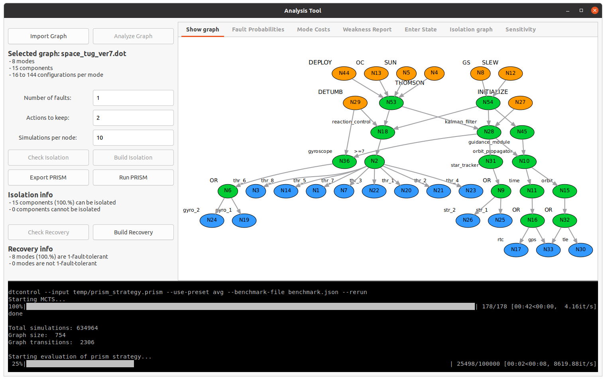

# pmc-fdir
Probabilistic Model Checking for FDIR



## Getting started
Clone the repository, navigate to its root and execute the install script:
```
./install.sh
```

## Use the GUI
Launch the gui via the virtual environment that install.sh created:
```
source python3-venv/bin/activate
cd src
python3 analysis_tool_gui.py
```

## Contact
If you have comments, found a bug, or have a suggestion for improvement, feel free to contact us via mail: j.kiesbye@tum.de

## Credits
The authors of this tool are Kush Grover and Jonis Kiesbye,
the software is released under Apache-2.0 License.
